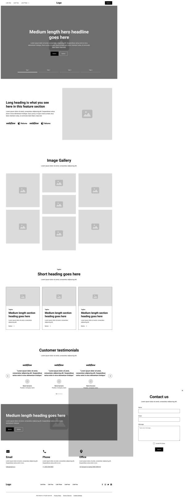
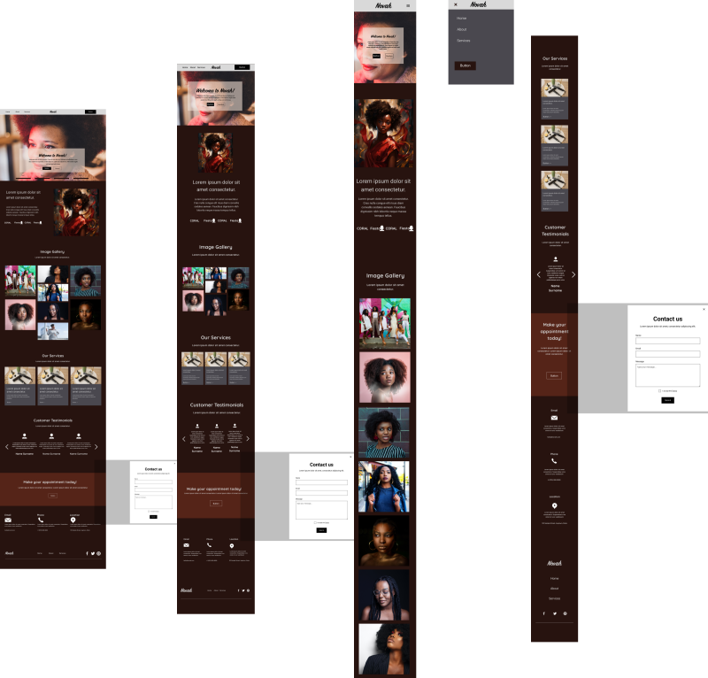
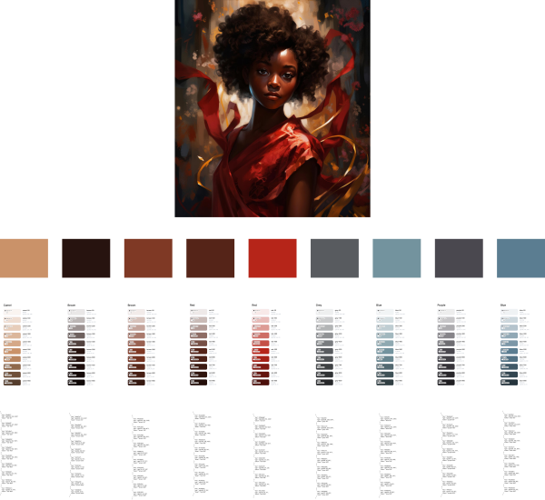
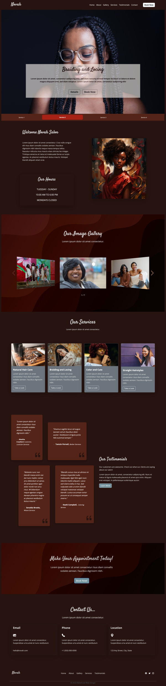

# Novah-Beauty-Landing-Page

## Landing page for Novah Beauty Salon
### Starting The Project
I've been working on my new design, _Novah Beauty Salon_, for couple of months. I started with by building a wireframe using the Relume Library Figma Kit. I was able to get the general design for the page. 
Then based on my inspiration from a picture, I created the color scheme. Finally, I designed the desktop, tablet, and mobile page versions of my landing page. After a few design changes, I have coded the final version of Novah Beauty Salon landing page. 
----
### Screenshots
#### Original Wireframe

#### Landing Page Design

#### Inspiration Photo and Color Scheme

#### Final Version of Landing Page

----
### Built With
- Semantic HTML5 markup
- Bootstrap5 Framework
- SwiftJS for Gallery Carousel
- Mobile-first  workflow
- Flexbox
- Vanilla CSS

### Resources
- [Header with Bottom Tabbed Carousel](https://www.tutorialrepublic.com/codelab.php?topic=bootstrap&file=carousel-with-tabbed-navigation)
- [Testimonials Slider](https://codingyaar.com/bootstrap-5-testimonial-slider/)
- [Changing Swiper Nav Buttons Color](https://oxygen4fun.supadezign.com/tips/swiperjs-tips-and-good-practice/#arrows)
- [Creating a Color System in Figma | 3 Easy Methods](https://www.youtube.com/watch?v=ZHhFWIq-viQ)

